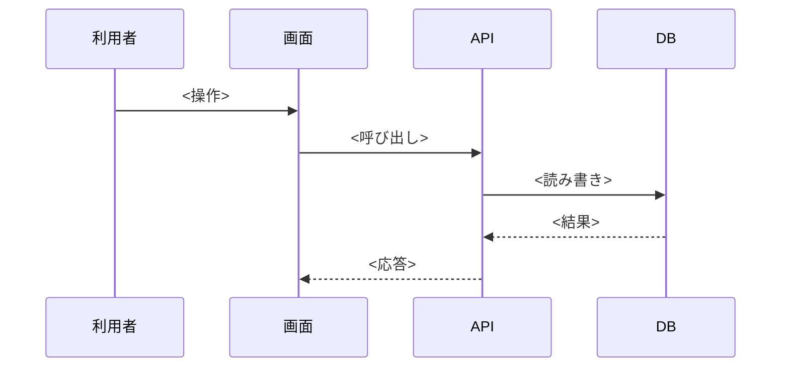

# 詳細設計 — <機能名>

<対象リポジトリ> / コミット `<ハッシュ>` 時点

書き方は `references/detail.md`。章の順番を変えない。該当が無い章は表ごと省く。

## 1. 概要

3 行以内。この機能が何をするか。どこから始まり、どこで終わるか。

## 2. 入口

| 種別 | 内容 |
| --- | --- |
| <画面の操作 / エンドポイント / Webhook / 定期処理> | <名前。API なら `METHOD /path`> |

認証・権限の要否もここに 1 行で書く。

## 3. シーケンス

| # | すること | 補足 |
| --- | --- | --- |
| 1 | <1〜2 行> | <条件があれば> |

## 4. 分岐とエラー

| 条件 | そのときの動き | 利用者から見える結果 |
| --- | --- | --- |
| <条件> | <内部の処理> | <表示・ステータスコード> |

## 5. データへの影響

| テーブル | 操作 | 変わるもの |
| --- | --- | --- |
| `<table>` | C / R / U / D | <カラムと値の意味> |

トランザクションの範囲と、途中で失敗したときの扱いを 1〜2 行で書く。
判定できなければ「未確認」。

## 6. 外部連携

| 連携先 | 向き | 送受信する項目 | 失敗したときの扱い |
| --- | --- | --- | --- |
| <名前> | 送信 / 受信 | <項目名> | <再送・無視・エラー表示など> |

## 7. 関連ファイル

| 役割 | パス |
| --- | --- |
| 入口 | `<repo 直下からの相対パス>` |

**実在するパスだけを書く。** `verify.py --mode detail` が存在を確かめる。

## 8. 未確認

| 対象 | 分からなかったこと | 調べた範囲 |
| --- | --- | --- |
